# 📚 Documentação Técnica - SelfCodeSupport

## Índice

1. [Status do Projeto](#status-do-projeto)
2. [Visão Geral](#visão-geral)
3. [Arquitetura](#arquitetura)
4. [Estrutura do Projeto](#estrutura-do-projeto)
5. [Modelos de Dados](#modelos-de-dados)
6. [Serviços e Interfaces](#serviços-e-interfaces)
7. [API Endpoints](#api-endpoints)
8. [Configuração](#configuração)
9. [Banco de Dados](#banco-de-dados)
10. [Fluxo de Trabalho](#fluxo-de-trabalho)
11. [Exemplos de Uso](#exemplos-de-uso)
12. [Segurança](#segurança)
13. [Troubleshooting](#troubleshooting)

---

## Status do Projeto

### ✅ Funcionalidades Implementadas

#### Infraestrutura Base
- ✅ Arquitetura em camadas (API, Core, Infrastructure)
- ✅ Dependency Injection configurado
- ✅ Swagger/OpenAPI integrado
- ✅ CORS configurado para desenvolvimento e produção
- ✅ Health checks básicos e detalhados
- ✅ Logging estruturado
- ✅ Tratamento de erros e exceções

#### Integração JIRA
- ✅ `JiraService` implementado
- ✅ Obtenção de tickets por ID
- ✅ Adição de comentários em tickets
- ✅ Criação de remote links (para PRs)
- ✅ Parsing de datas customizado para formatos JIRA
- ✅ Endpoint `GET /api/jira/ticket/{ticketId}`
- ✅ Mapeamento completo de campos do ticket

#### Integração Git
- ✅ `GitService` implementado com LibGit2Sharp
- ✅ Clone de repositórios
- ✅ Pull de atualizações
- ✅ Checkout de branches
- ✅ Criação de branches
- ✅ Criação de commits
- ✅ Push para remoto
- ✅ Verificação de status do repositório
- ✅ Suporte a autenticação via PAT

#### Integração Anthropic Claude AI
- ✅ `AnthropicService` implementado
- ✅ Análise de tickets com contexto de código
- ✅ Geração de código baseada em requisitos
- ✅ Geração de testes unitários
- ✅ Revisão de código
- ✅ Teste de conexão com API
- ✅ Timeout configurável
- ✅ Parsing de respostas JSON estruturadas

#### Integração GitHub Pull Requests
- ✅ `GitHubPullRequestService` implementado
- ✅ Criação de Pull Requests
- ✅ Descrição detalhada do PR
- ✅ Links para JIRA
- ✅ Teste de conexão

#### Workflow Orchestrator
- ✅ `WorkflowOrchestrator` implementado
- ✅ Fluxo completo de desenvolvimento
- ✅ Análise de tickets
- ✅ Aprovação e implementação
- ✅ Revisão de análises
- ✅ Cancelamento de workflows
- ✅ Rastreamento de status e progresso
- ✅ Histórico de workflows
- ✅ Métricas de workflows
- ✅ Eventos para notificações
- ✅ Persistência de resultados em memória

#### Gestão de Configurações
- ✅ Sistema completo de configurações com SQLite
- ✅ `ApplicationSettings` para configurações globais
- ✅ `ProjectSettings` para configurações por projeto
- ✅ `ISettingsService` e `SettingsService` implementados
- ✅ CRUD completo de projetos
- ✅ Configurações JIRA globais e por projeto
- ✅ Configurações Git globais e por projeto
- ✅ Configurações Anthropic globais
- ✅ Configurações de Workflow globais e por projeto
- ✅ Projeto padrão configurável
- ✅ Soft delete para projetos
- ✅ Auditoria (CreatedAt, UpdatedAt, UpdatedBy)
- ✅ `SettingsController` com todos os endpoints REST

#### Banco de Dados
- ✅ Entity Framework Core configurado
- ✅ SQLite como banco de dados
- ✅ `ApplicationDbContext` implementado
- ✅ Migrations criadas e aplicadas automaticamente
- ✅ Seed data para configurações iniciais
- ✅ Índices otimizados

#### API Endpoints
- ✅ `WorkflowController` - Todos os endpoints do workflow
- ✅ `JiraController` - Endpoints JIRA
- ✅ `SettingsController` - Gestão completa de configurações
- ✅ `HealthController` - Health checks
- ✅ Paginação no histórico de workflows
- ✅ Métricas de workflows
- ✅ Documentação Swagger completa

#### Documentação
- ✅ README.md com visão geral
- ✅ DOCUMENTATION.md com documentação técnica completa
- ✅ Comentários XML nos métodos públicos
- ✅ Exemplos de uso

#### Testes
- ✅ Estrutura de testes criada
- ✅ Testes unitários para `JiraService`
- ✅ Testes unitários para `AnthropicService`
- ✅ Testes para modelos (`AnalysisResult`, `ImplementationResult`)

---

### 🚧 Funcionalidades Parcialmente Implementadas

#### Build e Testes Automatizados
- ⚠️ Estrutura preparada no `WorkflowOrchestrator`
- ⚠️ Configurações disponíveis (`AutoBuild`, `AutoRunTests`)
- ❌ Execução real de build ainda não implementada
- ❌ Execução real de testes ainda não implementada
- ❌ Validação de cobertura de código não implementada

#### Geração de Código
- ✅ Interface e método `GenerateCodeAsync` implementados
- ⚠️ Integração com workflow parcial
- ❌ Aplicação automática de código gerado no repositório não implementada
- ❌ Validação de código gerado antes de commit não implementada

---

### ❌ Funcionalidades Pendentes

#### Autenticação e Autorização
- ❌ Sistema de autenticação (JWT, OAuth, etc.)
- ❌ Autorização baseada em roles
- ❌ Proteção de endpoints sensíveis
- ❌ Rate limiting

#### Notificações
- ❌ Sistema de notificações (email, webhooks, etc.)
- ❌ Notificações quando análise é concluída
- ❌ Notificações quando PR é criado
- ❌ Notificações de erros

#### Interface Web
- ❌ Frontend web para visualização e gestão
- ❌ Dashboard de métricas
- ❌ Visualização de workflows em tempo real
- ❌ Editor de configurações visual

#### Melhorias no Workflow
- ❌ Retry automático em caso de falhas
- ❌ Rollback automático em caso de erro
- ❌ Suporte a workflows paralelos
- ❌ Fila de processamento de workflows
- ❌ Priorização de workflows

#### Integrações Adicionais
- ❌ Integração com outros sistemas de versionamento (GitLab, Bitbucket)
- ❌ Integração com outros sistemas de tickets (Azure DevOps, Linear)
- ❌ Integração com sistemas de CI/CD (GitHub Actions, Azure DevOps Pipelines)
- ❌ Integração com sistemas de monitoramento (Application Insights, Prometheus)

#### Persistência Avançada
- ❌ Persistência de workflows em banco de dados (atualmente em memória)
- ❌ Histórico completo de execuções
- ❌ Backup e restore de configurações
- ❌ Migração de configurações entre ambientes

#### Segurança Avançada
- ❌ Criptografia de dados sensíveis no banco
- ❌ Rotação de credenciais
- ❌ Auditoria completa de ações
- ❌ Compliance e logging de segurança

#### Testes
- ❌ Testes de integração
- ❌ Testes end-to-end
- ❌ Testes de performance
- ❌ Cobertura de código aumentada

#### DevOps
- ❌ Dockerfile e containerização
- ❌ Docker Compose para ambiente completo
- ❌ CI/CD pipeline
- ❌ Deploy automatizado
- ❌ Monitoramento e alertas

#### Documentação
- ❌ Guia de contribuição
- ❌ Guia de deploy
- ❌ Diagramas de arquitetura atualizados
- ❌ Vídeos tutoriais

---

### 📊 Estatísticas do Projeto

- **Linhas de Código**: ~10.000+ linhas
- **Arquivos**: 49 arquivos
- **Endpoints API**: 30+ endpoints
- **Serviços**: 6 serviços principais
- **Modelos**: 10+ modelos de dados
- **Cobertura de Testes**: ~20% (parcial)

---

### 🎯 Próximos Passos Recomendados

1. **Alta Prioridade**
   - Implementar execução real de build e testes
   - Adicionar autenticação e autorização
   - Persistir workflows em banco de dados
   - Melhorar tratamento de erros e retry logic

2. **Média Prioridade**
   - Criar interface web básica
   - Implementar sistema de notificações
   - Adicionar mais testes (integração e E2E)
   - Melhorar documentação com exemplos práticos

3. **Baixa Prioridade**
   - Adicionar suporte a outros sistemas de versionamento
   - Implementar dashboard avançado
   - Adicionar métricas e monitoramento
   - Containerização e deploy automatizado

---

## Visão Geral

## Visão Geral

O **SelfCodeSupport** é uma API REST desenvolvida em .NET 8.0 que automatiza o ciclo completo de desenvolvimento de software, integrando:

- **JIRA**: Gerenciamento de tickets e documentação
- **Git/GitHub**: Controle de versão e Pull Requests
- **Anthropic Claude AI**: Análise inteligente e geração de código

### Funcionalidades Principais

- ✅ **Análise Automatizada de Tickets**: Analisa tickets JIRA e identifica arquivos, mudanças necessárias e impactos técnicos
- ✅ **Geração de Código com IA**: Utiliza Claude AI para gerar código seguindo padrões do projeto
- ✅ **Integração Git Completa**: Cria branches, commits e push automaticamente
- ✅ **Pull Requests Automatizados**: Cria PRs com descrição detalhada e checklist
- ✅ **Atualização JIRA**: Documenta análise e progresso no ticket automaticamente
- ✅ **Gestão de Configurações**: Sistema completo de configurações globais e por projeto com persistência em SQLite
- ✅ **Múltiplos Projetos**: Suporte para gerenciar múltiplos projetos com configurações independentes

---

## Arquitetura

O projeto segue os princípios de **Clean Architecture** e **Domain-Driven Design (DDD)**, organizando o código em camadas bem definidas:

```
┌─────────────────────────────────────────────────────────┐
│                    SelfCodeSupport.API                   │
│  (Controllers, Middleware, Configuração da Aplicação)    │
└────────────────────┬────────────────────────────────────┘
                     │
┌────────────────────▼────────────────────────────────────┐
│              SelfCodeSupport.Core                         │
│  (Interfaces, Modelos, Configurações, Domain Logic)     │
└────────────────────┬────────────────────────────────────┘
                     │
┌────────────────────▼────────────────────────────────────┐
│          SelfCodeSupport.Infrastructure                  │
│  (Implementações, Serviços Externos, Data Access)       │
└──────────────────────────────────────────────────────────┘
```

### Camadas

#### 1. **API Layer** (`SelfCodeSupport.API`)
- Controllers REST
- Middleware (CORS, Swagger, etc.)
- Configuração da aplicação (`Program.cs`)
- `appsettings.json`

#### 2. **Core Layer** (`SelfCodeSupport.Core`)
- **Interfaces**: Contratos dos serviços
- **Models**: Entidades de domínio
- **Configuration**: Classes de configuração
- **Sem dependências externas**: Pode ser usado por qualquer camada

#### 3. **Infrastructure Layer** (`SelfCodeSupport.Infrastructure`)
- **Services**: Implementações dos serviços
- **Data**: Entity Framework Core e DbContext
- **DependencyInjection**: Configuração de DI

---

## Estrutura do Projeto

```
SelfCodeSupport/
├── src/
│   ├── SelfCodeSupport.API/                    # Camada de API
│   │   ├── Controllers/
│   │   │   ├── HealthController.cs            # Health checks
│   │   │   ├── JiraController.cs             # Endpoints JIRA
│   │   │   ├── SettingsController.cs         # Gestão de configurações
│   │   │   └── WorkflowController.cs         # Endpoints do workflow
│   │   ├── Program.cs                         # Configuração da aplicação
│   │   ├── appsettings.json                  # Configurações
│   │   └── appsettings.Development.json      # Configurações de desenvolvimento
│   │
│   ├── SelfCodeSupport.Core/                  # Camada Core
│   │   ├── Configuration/
│   │   │   ├── AnthropicSettings.cs          # Configurações Anthropic
│   │   │   ├── GitSettings.cs                # Configurações Git
│   │   │   ├── JiraSettings.cs               # Configurações JIRA
│   │   │   └── WorkflowSettings.cs           # Configurações de Workflow
│   │   ├── Interfaces/
│   │   │   ├── IAnthropicService.cs          # Interface Anthropic
│   │   │   ├── IGitService.cs                # Interface Git
│   │   │   ├── IJiraService.cs               # Interface JIRA
│   │   │   ├── IPullRequestService.cs        # Interface Pull Request
│   │   │   ├── ISettingsService.cs           # Interface Settings
│   │   │   └── IWorkflowOrchestrator.cs      # Interface Orquestrador
│   │   └── Models/
│   │       ├── AnalysisResult.cs             # Resultado da análise
│   │       ├── ApplicationSettings.cs        # Configurações globais
│   │       ├── ImplementationResult.cs       # Resultado da implementação
│   │       ├── JiraTicket.cs                 # Modelo do ticket JIRA
│   │       ├── ProjectSettings.cs           # Configurações de projeto
│   │       └── PullRequestInfo.cs           # Informações do PR
│   │
│   └── SelfCodeSupport.Infrastructure/        # Camada de Infraestrutura
│       ├── Data/
│       │   └── ApplicationDbContext.cs       # DbContext do EF Core
│       ├── Migrations/                       # Migrations do banco de dados
│       ├── Services/
│       │   ├── AnthropicService.cs          # Implementação Anthropic
│       │   ├── GitHubPullRequestService.cs  # Implementação GitHub PR
│       │   ├── GitService.cs                # Implementação Git
│       │   ├── JiraService.cs               # Implementação JIRA
│       │   ├── SettingsService.cs           # Implementação Settings
│       │   └── WorkflowOrchestrator.cs      # Implementação Orquestrador
│       └── DependencyInjection.cs           # Configuração de DI
│
└── tests/
    └── SelfCodeSupport.Tests/               # Testes unitários
        ├── Models/
        └── Services/
```

---

## Modelos de Dados

### ApplicationSettings

Configurações globais da aplicação armazenadas no banco de dados.

```csharp
public class ApplicationSettings
{
    public int Id { get; set; } = 1; // Sempre ID 1
    public string ApplicationName { get; set; }
    public string Version { get; set; }
    public string JiraSettingsJson { get; set; }      // JSON serializado
    public string GitSettingsJson { get; set; }       // JSON serializado
    public string AnthropicSettingsJson { get; set; } // JSON serializado
    public string WorkflowSettingsJson { get; set; }  // JSON serializado
    public DateTime CreatedAt { get; set; }
    public DateTime UpdatedAt { get; set; }
    public string UpdatedBy { get; set; }
}
```

### ProjectSettings

Configurações específicas de um projeto.

```csharp
public class ProjectSettings
{
    public int Id { get; set; }
    public string Name { get; set; }                    // Nome único
    public string Description { get; set; }
    public string JiraProjectKey { get; set; }          // Ex: "PAC"
    public string GitRepositoryPath { get; set; }
    public string GitRemoteUrl { get; set; }
    public string GitDefaultBranch { get; set; }
    public string JiraSettingsJson { get; set; }        // JSON serializado
    public string GitSettingsJson { get; set; }         // JSON serializado
    public string WorkflowSettingsJson { get; set; }    // JSON serializado
    public string ProjectSpecificSettingsJson { get; set; } // JSON serializado
    public bool IsDefault { get; set; }                 // Projeto padrão
    public bool IsActive { get; set; }                  // Soft delete
    public DateTime CreatedAt { get; set; }
    public DateTime UpdatedAt { get; set; }
    public string UpdatedBy { get; set; }
}
```

### JiraTicket

Modelo representando um ticket JIRA.

```csharp
public class JiraTicket
{
    public string Id { get; set; }
    public string Key { get; set; }              // Ex: "PAC-892"
    public string Title { get; set; }
    public string Description { get; set; }
    public JiraTicketType Type { get; set; }    // Story, Bug, Task, Epic, Sub-task
    public JiraPriority Priority { get; set; }  // Highest, High, Medium, Low, Lowest
    public string? Assignee { get; set; }
    public string? Reporter { get; set; }
    public List<string> Labels { get; set; }
    public DateTime? Created { get; set; }
    public DateTime? Updated { get; set; }
    public string? Status { get; set; }
    public string? StatusCategory { get; set; }
}
```

### AnalysisResult

Resultado da análise de um ticket.

```csharp
public class AnalysisResult
{
    public string TicketId { get; set; }
    public DateTime AnalyzedAt { get; set; }
    public ComplexityLevel Complexity { get; set; }
    public int EstimatedEffortHours { get; set; }
    public List<AffectedFile> AffectedFiles { get; set; }
    public List<RequiredChange> RequiredChanges { get; set; }
    public TechnicalImpact TechnicalImpact { get; set; }
    public List<Risk> Risks { get; set; }
    public List<Opportunity> Opportunities { get; set; }
    public List<ImplementationStep> ImplementationPlan { get; set; }
    public List<ValidationCriterion> ValidationCriteria { get; set; }
    public string FormattedJiraComment { get; set; }
    public AnalysisStatus Status { get; set; }
}
```

### ImplementationResult

Resultado da implementação.

```csharp
public class ImplementationResult
{
    public string TicketId { get; set; }
    public DateTime ImplementedAt { get; set; }
    public List<FileChange> FilesChanged { get; set; }
    public string BranchName { get; set; }
    public string CommitHash { get; set; }
    public bool BuildSucceeded { get; set; }
    public bool TestsPassed { get; set; }
    public string? BuildOutput { get; set; }
    public string? TestOutput { get; set; }
    public ImplementationStatus Status { get; set; }
}
```

### PullRequestInfo

Informações do Pull Request criado.

```csharp
public class PullRequestInfo
{
    public int Number { get; set; }
    public string Url { get; set; }
    public string Title { get; set; }
    public string Description { get; set; }
    public string BranchName { get; set; }
    public string BaseBranch { get; set; }
    public PullRequestStatus Status { get; set; }
    public DateTime CreatedAt { get; set; }
}
```

---

## Serviços e Interfaces

### IWorkflowOrchestrator

Orquestra o fluxo completo de desenvolvimento.

**Métodos principais:**
- `StartWorkflowAsync()`: Inicia workflow completo
- `AnalyzeAsync()`: Executa apenas análise
- `ApproveAndImplementAsync()`: Aprova e implementa
- `RequestRevisionAsync()`: Solicita revisão
- `CancelWorkflowAsync()`: Cancela workflow
- `GetWorkflowStatusAsync()`: Obtém status atual
- `GetWorkflowHistoryAsync()`: Obtém histórico

### IJiraService

Integração com JIRA API.

**Métodos principais:**
- `GetTicketAsync()`: Obtém ticket por ID
- `AddCommentAsync()`: Adiciona comentário
- `CreateRemoteLinkAsync()`: Cria link remoto (ex: para PR)

### IGitService

Operações Git usando LibGit2Sharp.

**Métodos principais:**
- `CloneAsync()`: Clona repositório
- `PullAsync()`: Atualiza repositório
- `CheckoutAsync()`: Muda de branch
- `CreateBranchAsync()`: Cria nova branch
- `CommitAsync()`: Cria commit
- `PushAsync()`: Faz push
- `GetRepositoryStatusAsync()`: Obtém status do repositório

### IAnthropicService

Integração com Anthropic Claude API.

**Métodos principais:**
- `AnalyzeTicketAsync()`: Analisa ticket e código
- `GenerateCodeAsync()`: Gera código
- `GenerateTestsAsync()`: Gera testes
- `ReviewCodeAsync()`: Revisa código

### IPullRequestService

Criação de Pull Requests no GitHub.

**Métodos principais:**
- `CreatePullRequestAsync()`: Cria PR
- `TestConnectionAsync()`: Testa conexão

### ISettingsService

Gerenciamento de configurações.

**Métodos principais:**

**Configurações Globais:**
- `GetApplicationSettingsAsync()`
- `UpdateApplicationSettingsAsync()`
- `GetJiraSettingsAsync()` / `UpdateJiraSettingsAsync()`
- `GetGitSettingsAsync()` / `UpdateGitSettingsAsync()`
- `GetAnthropicSettingsAsync()` / `UpdateAnthropicSettingsAsync()`
- `GetWorkflowSettingsAsync()` / `UpdateWorkflowSettingsAsync()`

**Gestão de Projetos:**
- `GetAllProjectsAsync()`
- `GetProjectByIdAsync()` / `GetProjectByNameAsync()`
- `GetDefaultProjectAsync()`
- `CreateProjectAsync()`
- `UpdateProjectAsync()`
- `SetDefaultProjectAsync()`
- `DeleteProjectAsync()`

**Configurações por Projeto:**
- `GetProjectJiraSettingsAsync()` / `UpdateProjectJiraSettingsAsync()`
- `GetProjectGitSettingsAsync()` / `UpdateProjectGitSettingsAsync()`
- `GetProjectWorkflowSettingsAsync()` / `UpdateProjectWorkflowSettingsAsync()`

---

## API Endpoints

### Health Check

#### `GET /api/health`
Health check básico.

**Resposta:**
```json
{
  "status": "Healthy",
  "timestamp": "2024-01-15T10:30:00Z"
}
```

#### `GET /api/health/detailed`
Health check detalhado com status de todos os serviços.

**Resposta:**
```json
{
  "status": "Healthy",
  "timestamp": "2024-01-15T10:30:00Z",
  "services": {
    "jira": "Healthy",
    "git": "Healthy",
    "anthropic": "Healthy",
    "github": "Healthy"
  }
}
```

---

### Workflow

#### `POST /api/workflow/start/{ticketId}`
Inicia workflow completo (análise + implementação + PR).

**Parâmetros:**
- `ticketId` (path): ID do ticket JIRA (ex: "PAC-892")

**Resposta:**
```json
{
  "ticketId": "PAC-892",
  "ticketTitle": "Título do Ticket",
  "finalPhase": "Completed",
  "isSuccess": true,
  "analysis": { ... },
  "implementation": { ... },
  "pullRequest": { ... },
  "errors": [],
  "startedAt": "2024-01-15T10:00:00Z",
  "completedAt": "2024-01-15T10:15:00Z",
  "duration": "00:15:00"
}
```

#### `POST /api/workflow/analyze/{ticketId}`
Executa apenas a fase de análise.

**Resposta:**
```json
{
  "ticketId": "PAC-892",
  "analyzedAt": "2024-01-15T10:05:00Z",
  "complexity": "Medium",
  "estimatedEffortHours": 4,
  "affectedFiles": [
    {
      "path": "Controllers/UserController.cs",
      "changeType": "Modify",
      "description": "Adicionar endpoint de busca"
    }
  ],
  "status": "Completed"
}
```

#### `POST /api/workflow/approve/{ticketId}`
Aprova a análise e continua com a implementação.

**Resposta:**
```json
{
  "ticketId": "PAC-892",
  "implementedAt": "2024-01-15T10:10:00Z",
  "filesChanged": [ ... ],
  "branchName": "feature/PAC-892",
  "commitHash": "abc123...",
  "buildSucceeded": true,
  "testsPassed": true,
  "status": "Completed"
}
```

#### `POST /api/workflow/revise/{ticketId}`
Solicita revisão da análise.

**Body:**
```json
{
  "feedback": "Preciso de mais detalhes sobre o impacto em performance"
}
```

#### `POST /api/workflow/cancel/{ticketId}`
Cancela o workflow em andamento.

**Body:**
```json
{
  "reason": "Ticket foi cancelado no JIRA"
}
```

#### `GET /api/workflow/status/{ticketId}`
Obtém o status atual do workflow.

**Resposta:**
```json
{
  "ticketId": "PAC-892",
  "currentPhase": "AnalyzingCode",
  "state": "Running",
  "message": "Analisando código com IA...",
  "progressPercentage": 50,
  "lastUpdated": "2024-01-15T10:05:00Z"
}
```

#### `GET /api/workflow/history`
Obtém histórico de workflows (paginado).

**Query Parameters:**
- `limit` (opcional, padrão: 20): Número de itens por página
- `offset` (opcional, padrão: 0): Offset para paginação

**Resposta:**
```json
{
  "items": [
    {
      "ticketId": "PAC-892",
      "ticketTitle": "Título do Ticket",
      "finalPhase": "Completed",
      "isSuccess": true,
      "startedAt": "2024-01-15T10:00:00Z",
      "completedAt": "2024-01-15T10:15:00Z",
      "pullRequestUrl": "https://github.com/org/repo/pull/123"
    }
  ],
  "total": 42,
  "limit": 20,
  "offset": 0
}
```

#### `GET /api/workflow/metrics`
Obtém métricas dos workflows.

**Resposta:**
```json
{
  "totalWorkflows": 42,
  "successRate": 85.5,
  "averageImplementationTime": 1800,
  "prsCreatedToday": 3
}
```

---

### JIRA

#### `GET /api/jira/ticket/{ticketId}`
Obtém detalhes de um ticket JIRA.

**Resposta:**
```json
{
  "id": "12345",
  "key": "PAC-892",
  "title": "Título do ticket",
  "description": "Descrição detalhada...",
  "type": "Story",
  "priority": "High",
  "assignee": "nome.usuario",
  "reporter": "nome.reporter",
  "labels": ["label1", "label2"],
  "created": "2024-01-14T10:00:00Z",
  "updated": "2024-01-14T12:00:00Z",
  "status": "In Progress",
  "statusCategory": "IN_PROGRESS"
}
```

---

### Settings (Configurações)

#### Configurações Globais

##### `GET /api/settings/application`
Obtém configurações globais da aplicação.

##### `PUT /api/settings/application`
Atualiza configurações globais.

**Query Parameters:**
- `updatedBy` (opcional, padrão: "system"): Usuário que fez a atualização

##### `GET /api/settings/application/jira`
Obtém configurações JIRA globais.

##### `PUT /api/settings/application/jira`
Atualiza configurações JIRA globais.

**Body:**
```json
{
  "baseUrl": "https://empresa.atlassian.net",
  "email": "usuario@empresa.com",
  "apiToken": "token-jira",
  "defaultProjectKey": "PAC"
}
```

##### `GET /api/settings/application/git`
Obtém configurações Git globais.

##### `PUT /api/settings/application/git`
Atualiza configurações Git globais.

##### `GET /api/settings/application/anthropic`
Obtém configurações Anthropic globais.

##### `PUT /api/settings/application/anthropic`
Atualiza configurações Anthropic globais.

##### `GET /api/settings/application/workflow`
Obtém configurações de Workflow globais.

##### `PUT /api/settings/application/workflow`
Atualiza configurações de Workflow globais.

#### Gestão de Projetos

##### `GET /api/settings/projects`
Lista todos os projetos ativos.

**Resposta:**
```json
[
  {
    "id": 1,
    "name": "Paccar-Subscriptions",
    "description": "Sistema de assinaturas",
    "jiraProjectKey": "PAC",
    "gitRepositoryPath": "C:\\repos\\Paccar-Subscriptions",
    "gitRemoteUrl": "https://github.com/org/repo.git",
    "gitDefaultBranch": "Acceptance",
    "isDefault": true,
    "isActive": true,
    "createdAt": "2024-01-01T00:00:00Z",
    "updatedAt": "2024-01-15T10:00:00Z"
  }
]
```

##### `GET /api/settings/projects/{projectId}`
Obtém projeto por ID.

##### `GET /api/settings/projects/name/{name}`
Obtém projeto por nome.

##### `GET /api/settings/projects/default`
Obtém o projeto padrão.

##### `POST /api/settings/projects`
Cria novo projeto.

**Body:**
```json
{
  "name": "Novo-Projeto",
  "description": "Descrição do projeto",
  "jiraProjectKey": "NP",
  "gitRepositoryPath": "C:\\repos\\Novo-Projeto",
  "gitRemoteUrl": "https://github.com/org/novo-projeto.git",
  "gitDefaultBranch": "main",
  "isDefault": false
}
```

**Query Parameters:**
- `createdBy` (opcional, padrão: "system")

##### `PUT /api/settings/projects/{projectId}`
Atualiza projeto existente.

**Query Parameters:**
- `updatedBy` (opcional, padrão: "system")

##### `POST /api/settings/projects/{projectId}/set-default`
Define projeto como padrão.

**Query Parameters:**
- `updatedBy` (opcional, padrão: "system")

##### `DELETE /api/settings/projects/{projectId}`
Deleta projeto (soft delete - marca como inativo).

#### Configurações por Projeto

##### `GET /api/settings/projects/{projectId}/jira`
Obtém configurações JIRA do projeto.

##### `PUT /api/settings/projects/{projectId}/jira`
Atualiza configurações JIRA do projeto.

##### `GET /api/settings/projects/{projectId}/git`
Obtém configurações Git do projeto.

##### `PUT /api/settings/projects/{projectId}/git`
Atualiza configurações Git do projeto.

##### `GET /api/settings/projects/{projectId}/workflow`
Obtém configurações de Workflow do projeto.

##### `PUT /api/settings/projects/{projectId}/workflow`
Atualiza configurações de Workflow do projeto.

---

## Configuração

### appsettings.json

Estrutura básica de configuração:

```json
{
  "Jira": {
    "BaseUrl": "https://empresa.atlassian.net",
    "Email": "usuario@empresa.com",
    "ApiToken": "token-jira",
    "DefaultProjectKey": "PAC"
  },
  "Git": {
    "RepositoryPath": "C:\\repos\\Projeto",
    "RemoteUrl": "https://github.com/org/repo.git",
    "DefaultBranch": "main",
    "Credentials": {
      "Username": "usuario",
      "PersonalAccessToken": "ghp_token"
    },
    "PullRequestSettings": {
      "Owner": "org",
      "Repository": "repo",
      "ApiToken": "ghp_token"
    }
  },
  "Anthropic": {
    "ApiKey": "sk-ant-api03-...",
    "TimeoutSeconds": 600,
    "Model": "claude-3-5-sonnet-20241022",
    "MaxTokens": 4096
  },
  "Workflow": {
    "RequireApprovalBeforeImplementation": true,
    "AutoBuild": true,
    "AutoRunTests": true,
    "MinimumCodeCoverage": 80,
    "AutoCreatePullRequest": true,
    "AutoUpdateJira": true
  }
}
```

### User Secrets (Desenvolvimento)

Para desenvolvimento local, use User Secrets:

```bash
cd src/SelfCodeSupport.API
dotnet user-secrets init
dotnet user-secrets set "Jira:ApiToken" "seu-token"
dotnet user-secrets set "Anthropic:ApiKey" "sua-api-key"
dotnet user-secrets set "Git:Credentials:PersonalAccessToken" "seu-pat"
```

### Variáveis de Ambiente

Em produção, use variáveis de ambiente:

```bash
Jira__ApiToken=seu-token
Anthropic__ApiKey=sua-api-key
Git__Credentials__PersonalAccessToken=seu-pat
```

---

## Banco de Dados

### SQLite

O sistema utiliza **SQLite** para persistir configurações. O banco de dados é criado automaticamente na primeira execução.

**Localização:**
- Windows: `%LocalAppData%\SelfCodeSupport\settings.db`
- Linux/Mac: `~/.local/share/SelfCodeSupport/settings.db`

### Schema

#### ApplicationSettings
- `Id` (INTEGER, PK): Sempre 1
- `ApplicationName` (TEXT)
- `Version` (TEXT)
- `JiraSettingsJson` (TEXT): JSON serializado
- `GitSettingsJson` (TEXT): JSON serializado
- `AnthropicSettingsJson` (TEXT): JSON serializado
- `WorkflowSettingsJson` (TEXT): JSON serializado
- `CreatedAt` (TEXT)
- `UpdatedAt` (TEXT)
- `UpdatedBy` (TEXT)

#### ProjectSettings
- `Id` (INTEGER, PK, AUTOINCREMENT)
- `Name` (TEXT, UNIQUE)
- `Description` (TEXT)
- `JiraProjectKey` (TEXT)
- `GitRepositoryPath` (TEXT)
- `GitRemoteUrl` (TEXT)
- `GitDefaultBranch` (TEXT)
- `JiraSettingsJson` (TEXT)
- `GitSettingsJson` (TEXT)
- `WorkflowSettingsJson` (TEXT)
- `ProjectSpecificSettingsJson` (TEXT)
- `IsDefault` (INTEGER, BOOLEAN)
- `IsActive` (INTEGER, BOOLEAN)
- `CreatedAt` (TEXT)
- `UpdatedAt` (TEXT)
- `UpdatedBy` (TEXT)

### Migrations

As migrations são aplicadas automaticamente na inicialização da aplicação. Para criar uma nova migration:

```bash
cd src/SelfCodeSupport.API
dotnet ef migrations add NomeDaMigration --context ApplicationDbContext --project ..\SelfCodeSupport.Infrastructure\SelfCodeSupport.Infrastructure.csproj
```

Para aplicar migrations manualmente:

```bash
dotnet ef database update --context ApplicationDbContext --project ..\SelfCodeSupport.Infrastructure\SelfCodeSupport.Infrastructure.csproj --startup-project SelfCodeSupport.API.csproj
```

---

## Fluxo de Trabalho

### Fases do Workflow

1. **NotStarted**: Workflow não iniciado
2. **FetchingTicket**: Obtendo informações do ticket JIRA
3. **AnalyzingCode**: Analisando código com IA
4. **WaitingApproval**: Aguardando aprovação da análise
5. **Implementing**: Implementando código
6. **Building**: Compilando projeto
7. **Testing**: Executando testes
8. **CreatingBranch**: Criando branch Git
9. **Committing**: Criando commit
10. **Pushing**: Fazendo push para remoto
11. **CreatingPullRequest**: Criando Pull Request
12. **UpdatingJira**: Atualizando JIRA
13. **Completed**: Concluído com sucesso
14. **Failed**: Falhou
15. **Cancelled**: Cancelado

### Fluxo Completo

```mermaid
graph TD
    A[Iniciar Workflow] --> B[Obter Ticket JIRA]
    B --> C[Preparar Repositório Git]
    C --> D[Buscar Arquivos Relacionados]
    D --> E[Analisar com Claude AI]
    E --> F{Aprovação}
    F -->|Aprovado| G[Criar Branch]
    F -->|Revisar| E
    G --> H[Gerar Código com IA]
    H --> I[Compilar Projeto]
    I --> J{Compilou?}
    J -->|Não| K[Falha]
    J -->|Sim| L[Executar Testes]
    L --> M{Testes OK?}
    M -->|Não| K
    M -->|Sim| N[Criar Commit]
    N --> O[Push para Remoto]
    O --> P[Criar Pull Request]
    P --> Q[Atualizar JIRA]
    Q --> R[Concluído]
```



### Fluxo com Aprovação

1. **Análise**: `POST /api/workflow/analyze/{ticketId}`
2. **Revisão**: Usuário revisa análise no JIRA ou via API
3. **Aprovação**: `POST /api/workflow/approve/{ticketId}`
4. **Implementação**: Sistema implementa automaticamente
5. **PR**: Pull Request é criado automaticamente

---

## Exemplos de Uso

### Exemplo 1: Workflow Completo

```bash
# 1. Iniciar análise
curl -X POST "https://localhost:5001/api/workflow/analyze/PAC-892"

# 2. Verificar status
curl -X GET "https://localhost:5001/api/workflow/status/PAC-892"

# 3. Aprovar e implementar
curl -X POST "https://localhost:5001/api/workflow/approve/PAC-892"

# 4. Verificar resultado final
curl -X GET "https://localhost:5001/api/workflow/status/PAC-892"
```

### Exemplo 2: Criar e Configurar Projeto

```bash
# 1. Criar projeto
curl -X POST "https://localhost:5001/api/settings/projects?createdBy=usuario" \
  -H "Content-Type: application/json" \
  -d '{
    "name": "Meu-Projeto",
    "description": "Descrição do projeto",
    "jiraProjectKey": "MP",
    "gitRepositoryPath": "C:\\repos\\Meu-Projeto",
    "gitRemoteUrl": "https://github.com/org/meu-projeto.git",
    "gitDefaultBranch": "main",
    "isDefault": true
  }'

# 2. Configurar JIRA do projeto
curl -X PUT "https://localhost:5001/api/settings/projects/1/jira?updatedBy=usuario" \
  -H "Content-Type: application/json" \
  -d '{
    "baseUrl": "https://empresa.atlassian.net",
    "email": "usuario@empresa.com",
    "apiToken": "token-jira",
    "defaultProjectKey": "MP"
  }'

# 3. Configurar Git do projeto
curl -X PUT "https://localhost:5001/api/settings/projects/1/git?updatedBy=usuario" \
  -H "Content-Type: application/json" \
  -d '{
    "repositoryPath": "C:\\repos\\Meu-Projeto",
    "remoteUrl": "https://github.com/org/meu-projeto.git",
    "defaultBranch": "main",
    "credentials": {
      "username": "usuario",
      "personalAccessToken": "ghp_token"
    }
  }'
```

### Exemplo 3: Obter Métricas

```bash
# Obter métricas dos workflows
curl -X GET "https://localhost:5001/api/workflow/metrics"

# Obter histórico paginado
curl -X GET "https://localhost:5001/api/workflow/history?limit=10&offset=0"
```

### Exemplo 4: Usando C# HttpClient

```csharp
using var client = new HttpClient();
client.BaseAddress = new Uri("https://localhost:5001");

// Iniciar análise
var response = await client.PostAsync("/api/workflow/analyze/PAC-892", null);
var analysis = await response.Content.ReadFromJsonAsync<AnalysisResult>();

// Aprovar e implementar
await client.PostAsync("/api/workflow/approve/PAC-892", null);

// Verificar status
var status = await client.GetFromJsonAsync<WorkflowStatus>("/api/workflow/status/PAC-892");
```

---

## Segurança

### Boas Práticas

1. **Nunca commite credenciais** no código
2. **Use User Secrets** em desenvolvimento
3. **Use Azure Key Vault** ou similar em produção
4. **Valide inputs** em todos os endpoints
5. **Use HTTPS** em produção
6. **Implemente autenticação/autorização** se necessário

### Configuração de CORS

O sistema está configurado para aceitar requisições de qualquer origem em desenvolvimento. Em produção, configure CORS adequadamente:

```csharp
builder.Services.AddCors(options =>
{
    options.AddPolicy("Production", policy =>
    {
        policy.WithOrigins("https://seu-frontend.com")
              .AllowAnyMethod()
              .AllowAnyHeader()
              .AllowCredentials();
    });
});
```

### Proteção de Dados Sensíveis

- Tokens e senhas são armazenados como JSON serializado no banco
- Considere criptografar dados sensíveis antes de salvar
- Use variáveis de ambiente ou serviços de secrets management

---

## Troubleshooting

### Problema: Erro 404 ao buscar ticket JIRA

**Causa:** URL do JIRA incorreta ou token inválido.

**Solução:**
1. Verifique a URL no `appsettings.json`
2. Verifique se o token JIRA está correto
3. Reinicie a aplicação após alterar configurações

### Problema: Erro ao fazer push no Git

**Causa:** Credenciais inválidas ou falta de permissões.

**Solução:**
1. Verifique o Personal Access Token do GitHub
2. Verifique se o token tem permissões de `repo`
3. Verifique se o repositório existe e está acessível

### Problema: Timeout na API Anthropic

**Causa:** Requisições muito longas ou timeout configurado muito baixo.

**Solução:**
1. Aumente `Anthropic:TimeoutSeconds` no `appsettings.json`
2. Verifique sua conexão com a internet
3. Verifique se a API key está correta

### Problema: Banco de dados não criado

**Causa:** Permissões insuficientes ou caminho inválido.

**Solução:**
1. Verifique permissões de escrita em `%LocalAppData%`
2. Verifique se o diretório pode ser criado
3. Execute a aplicação como administrador se necessário

### Problema: Migration não aplicada

**Causa:** Erro na migration ou banco corrompido.

**Solução:**
1. Delete o arquivo `settings.db` e recrie
2. Verifique logs de erro da aplicação
3. Execute migration manualmente: `dotnet ef database update`

### Problema: CORS 307 com ngrok

**Causa:** Redirecionamento HTTP->HTTPS interceptando OPTIONS.

**Solução:** Já resolvido no código com middleware customizado que trata OPTIONS antes do redirecionamento.

---

## Conclusão

Esta documentação cobre os aspectos principais do sistema SelfCodeSupport. Para mais informações, consulte:

- Código-fonte comentado
- Swagger UI em `/swagger` quando a aplicação estiver rodando
- Logs da aplicação para debugging
- Seção [Status do Projeto](#status-do-projeto) para ver o que já foi implementado e o que ainda falta

### Estado Atual

O sistema SelfCodeSupport está em **desenvolvimento ativo** com a maioria das funcionalidades core implementadas. O sistema já é funcional para:

- ✅ Análise automatizada de tickets JIRA
- ✅ Gestão completa de configurações
- ✅ Integração com Git e GitHub
- ✅ Criação de Pull Requests
- ✅ Integração com Anthropic Claude AI

Funcionalidades como build automatizado, testes automatizados e interface web estão planejadas para próximas versões.

---

**Última atualização:** Janeiro 2024  
**Versão da API:** 1.0.0  
**Status:** Em Desenvolvimento Ativo
