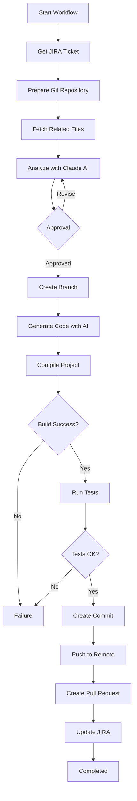

# 🚀 SelfCodeSupport

Automated Development System integrated with **JIRA**, **Git**, and **Anthropic Claude AI**.

[](https://dotnet.microsoft.com/)
[](LICENSE)

## 📋 Overview

**SelfCodeSupport** is a REST API built with .NET 8.0 that automates the complete software development cycle, from analyzing JIRA tickets to creating Pull Requests, using artificial intelligence for code analysis and solution generation.

### 🎯 Key Features

- **📊 Automated Analysis**: Analyzes JIRA tickets and identifies files, required changes, and technical impacts
- **🤖 AI-Powered Code Generation**: Uses Claude AI to generate code following project patterns
- **🔀 Complete Git Integration**: Creates branches, commits, and pushes automatically
- **📝 Automated Pull Requests**: Creates PRs with detailed descriptions and checklists
- **📢 JIRA Updates**: Automatically documents analysis and progress in tickets
- **⚙️ Settings Management**: Complete settings system with global and per-project configurations persisted in SQLite
- **📁 Multi-Project Support**: Manage multiple projects with independent configurations
- **✅ Validation**: Automated build and tests before PR creation
- **📈 Metrics & History**: Track workflow metrics and execution history

---

## 🏗️ Architecture

The project follows **Clean Architecture** and **Domain-Driven Design (DDD)** principles, organizing code into well-defined layers:

```
┌─────────────────────────────────────────────────────────┐
│                    SelfCodeSupport.API                   │
│  (Controllers, Middleware, Application Configuration)    │
└────────────────────┬────────────────────────────────────┘
                     │
┌────────────────────▼────────────────────────────────────┐
│              SelfCodeSupport.Core                         │
│  (Interfaces, Models, Configurations, Domain Logic)     │
└────────────────────┬────────────────────────────────────┘
                     │
┌────────────────────▼────────────────────────────────────┐
│          SelfCodeSupport.Infrastructure                  │
│  (Implementations, External Services, Data Access)       │
└──────────────────────────────────────────────────────────┘
```

### Project Structure

```
SelfCodeSupport/
├── src/
│   ├── SelfCodeSupport.API/                    # API Layer
│   │   ├── Controllers/
│   │   │   ├── HealthController.cs            # Health checks
│   │   │   ├── JiraController.cs             # JIRA endpoints
│   │   │   ├── SettingsController.cs         # Settings management
│   │   │   └── WorkflowController.cs         # Workflow endpoints
│   │   ├── Program.cs                         # Application configuration
│   │   └── appsettings.json                  # Configuration
│   │
│   ├── SelfCodeSupport.Core/                  # Core Layer
│   │   ├── Configuration/
│   │   │   ├── AnthropicSettings.cs          # Anthropic settings
│   │   │   ├── GitSettings.cs                # Git settings
│   │   │   ├── JiraSettings.cs               # JIRA settings
│   │   │   └── WorkflowSettings.cs           # Workflow settings
│   │   ├── Interfaces/
│   │   │   ├── IAnthropicService.cs          # Anthropic interface
│   │   │   ├── IGitService.cs                # Git interface
│   │   │   ├── IJiraService.cs               # JIRA interface
│   │   │   ├── IPullRequestService.cs        # Pull Request interface
│   │   │   ├── ISettingsService.cs           # Settings interface
│   │   │   └── IWorkflowOrchestrator.cs      # Orchestrator interface
│   │   └── Models/
│   │       ├── AnalysisResult.cs             # Analysis result
│   │       ├── ApplicationSettings.cs        # Global settings
│   │       ├── ImplementationResult.cs       # Implementation result
│   │       ├── JiraTicket.cs                 # JIRA ticket model
│   │       ├── ProjectSettings.cs           # Project settings
│   │       └── PullRequestInfo.cs           # PR information
│   │
│   └── SelfCodeSupport.Infrastructure/        # Infrastructure Layer
│       ├── Data/
│       │   └── ApplicationDbContext.cs       # EF Core DbContext
│       ├── Migrations/                       # Database migrations
│       ├── Services/
│       │   ├── AnthropicService.cs          # Anthropic implementation
│       │   ├── GitHubPullRequestService.cs  # GitHub PR implementation
│       │   ├── GitService.cs                # Git implementation
│       │   ├── JiraService.cs               # JIRA implementation
│       │   ├── SettingsService.cs         # Settings implementation
│       │   └── WorkflowOrchestrator.cs       # Orchestrator implementation
│       └── DependencyInjection.cs           # DI configuration
│
└── tests/
    └── SelfCodeSupport.Tests/               # Unit tests
        ├── Models/
        └── Services/
```

---

## 🚀 Quick Start

### Prerequisites

- [.NET 8.0 SDK](https://dotnet.microsoft.com/download/dotnet/8.0)
- [JIRA](https://www.atlassian.com/software/jira) account with API Token
- [GitHub](https://github.com) account with Personal Access Token
- [Anthropic](https://www.anthropic.com/) API Key

### Installation

1. **Clone the repository**
```bash
git clone https://github.com/vitorcastro78/SelfCodeSupport.git
cd SelfCodeSupport
```

2. **Restore dependencies**
```bash
dotnet restore
```

3. **Configure credentials**

Edit `src/SelfCodeSupport.API/appsettings.json`:

```json
{
  "Jira": {
    "BaseUrl": "https://your-company.atlassian.net",
    "Email": "your-email@company.com",
    "ApiToken": "your-jira-token"
  },
  "Git": {
    "RepositoryPath": "C:\\path\\to\\your\\repository",
    "Credentials": {
      "Username": "your-username",
      "PersonalAccessToken": "your-github-pat"
    },
    "PullRequestSettings": {
      "Owner": "your-org",
      "Repository": "your-repo",
      "ApiToken": "your-github-pat"
    }
  },
  "Anthropic": {
    "ApiKey": "your-anthropic-api-key"
  }
}
```

4. **Run the application**
```bash
cd src/SelfCodeSupport.API
dotnet run
```

5. **Access Swagger**

Open your browser at: `https://localhost:5001/swagger`

---

## 📖 API Usage

### Available Endpoints

#### Health Check

| Method | Endpoint | Description |
|--------|----------|-------------|
| GET | `/api/health` | Basic health check |
| GET | `/api/health/detailed` | Detailed health check with service status |

#### Workflow

| Method | Endpoint | Description |
|--------|----------|-------------|
| POST | `/api/workflow/start/{ticketId}` | Start complete workflow |
| POST | `/api/workflow/analyze/{ticketId}` | Execute analysis only |
| POST | `/api/workflow/approve/{ticketId}` | Approve and implement |
| POST | `/api/workflow/revise/{ticketId}` | Request revision |
| POST | `/api/workflow/cancel/{ticketId}` | Cancel workflow |
| GET | `/api/workflow/status/{ticketId}` | Get workflow status |
| GET | `/api/workflow/history` | Get workflow history (paginated) |
| GET | `/api/workflow/metrics` | Get workflow metrics |

#### JIRA

| Method | Endpoint | Description |
|--------|----------|-------------|
| GET | `/api/jira/ticket/{ticketId}` | Get JIRA ticket details |

#### Settings

**Global Settings:**
- `GET /api/settings/application` - Get global application settings
- `PUT /api/settings/application` - Update global settings
- `GET /api/settings/application/jira` - Get global JIRA settings
- `PUT /api/settings/application/jira` - Update global JIRA settings
- `GET /api/settings/application/git` - Get global Git settings
- `PUT /api/settings/application/git` - Update global Git settings
- `GET /api/settings/application/anthropic` - Get global Anthropic settings
- `PUT /api/settings/application/anthropic` - Update global Anthropic settings
- `GET /api/settings/application/workflow` - Get global workflow settings
- `PUT /api/settings/application/workflow` - Update global workflow settings

**Project Management:**
- `GET /api/settings/projects` - List all active projects
- `GET /api/settings/projects/{projectId}` - Get project by ID
- `GET /api/settings/projects/name/{name}` - Get project by name
- `GET /api/settings/projects/default` - Get default project
- `POST /api/settings/projects` - Create new project
- `PUT /api/settings/projects/{projectId}` - Update project
- `POST /api/settings/projects/{projectId}/set-default` - Set as default project
- `DELETE /api/settings/projects/{projectId}` - Delete project (soft delete)

**Project-Specific Settings:**
- `GET /api/settings/projects/{projectId}/jira` - Get project JIRA settings
- `PUT /api/settings/projects/{projectId}/jira` - Update project JIRA settings
- `GET /api/settings/projects/{projectId}/git` - Get project Git settings
- `PUT /api/settings/projects/{projectId}/git` - Update project Git settings
- `GET /api/settings/projects/{projectId}/workflow` - Get project workflow settings
- `PUT /api/settings/projects/{projectId}/workflow` - Update project workflow settings

### Usage Examples

#### 1. Start Analysis

```bash
curl -X POST "https://localhost:5001/api/workflow/analyze/PROJ-1234"
```

**Response:**
```json
{
  "ticketId": "PROJ-1234",
  "analyzedAt": "2024-01-15T10:30:00Z",
  "complexity": "Medium",
  "estimatedEffortHours": 4,
  "affectedFiles": [
    {
      "path": "Controllers/UserController.cs",
      "changeType": "Modify",
      "description": "Add search endpoint"
    }
  ],
  "status": "Completed"
}
```

#### 2. Approve Implementation

```bash
curl -X POST "https://localhost:5001/api/workflow/approve/PROJ-1234"
```

#### 3. Check Status

```bash
curl -X GET "https://localhost:5001/api/workflow/status/PROJ-1234"
```

#### 4. Create and Configure Project

```bash
# Create project
curl -X POST "https://localhost:5001/api/settings/projects?createdBy=user" \
  -H "Content-Type: application/json" \
  -d '{
    "name": "My-Project",
    "description": "Project description",
    "jiraProjectKey": "MP",
    "gitRepositoryPath": "C:\\repos\\My-Project",
    "gitRemoteUrl": "https://github.com/org/my-project.git",
    "gitDefaultBranch": "main",
    "isDefault": true
  }'

# Configure project JIRA settings
curl -X PUT "https://localhost:5001/api/settings/projects/1/jira?updatedBy=user" \
  -H "Content-Type: application/json" \
  -d '{
    "baseUrl": "https://company.atlassian.net",
    "email": "user@company.com",
    "apiToken": "jira-token",
    "defaultProjectKey": "MP"
  }'
```

---

## ⚙️ Configuration

### appsettings.json

Basic configuration structure:

```json
{
  "Jira": {
    "BaseUrl": "https://company.atlassian.net",
    "Email": "user@company.com",
    "ApiToken": "jira-token",
    "DefaultProjectKey": "PROJ"
  },
  "Git": {
    "RepositoryPath": "C:\\repos\\Project",
    "RemoteUrl": "https://github.com/org/repo.git",
    "DefaultBranch": "main",
    "Credentials": {
      "Username": "username",
      "PersonalAccessToken": "ghp_token"
    },
    "PullRequestSettings": {
      "Owner": "org",
      "Repository": "repo",
      "ApiToken": "ghp_token"
    }
  },
  "Anthropic": {
    "ApiKey": "sk-ant-api03-...",
    "TimeoutSeconds": 600,
    "Model": "claude-3-5-sonnet-20241022",
    "MaxTokens": 4096
  },
  "Workflow": {
    "RequireApprovalBeforeImplementation": true,
    "AutoBuild": true,
    "AutoRunTests": true,
    "MinimumCodeCoverage": 80,
    "AutoCreatePullRequest": true,
    "AutoUpdateJira": true
  }
}
```

### User Secrets (Development)

For local development, use User Secrets:

```bash
cd src/SelfCodeSupport.API
dotnet user-secrets init
dotnet user-secrets set "Jira:ApiToken" "your-token"
dotnet user-secrets set "Anthropic:ApiKey" "your-api-key"
dotnet user-secrets set "Git:Credentials:PersonalAccessToken" "your-pat"
```

### Environment Variables

In production, use environment variables:

```bash
Jira__ApiToken=your-token
Anthropic__ApiKey=your-api-key
Git__Credentials__PersonalAccessToken=your-pat
```

---

## 🗄️ Database

### SQLite

The system uses **SQLite** to persist settings. The database is automatically created on first run.

**Location:**
- Windows: `%LocalAppData%\SelfCodeSupport\settings.db`
- Linux/Mac: `~/.local/share/SelfCodeSupport/settings.db`

### Schema

#### ApplicationSettings
- `Id` (INTEGER, PK): Always 1
- `ApplicationName` (TEXT)
- `Version` (TEXT)
- `JiraSettingsJson` (TEXT): Serialized JSON
- `GitSettingsJson` (TEXT): Serialized JSON
- `AnthropicSettingsJson` (TEXT): Serialized JSON
- `WorkflowSettingsJson` (TEXT): Serialized JSON
- `CreatedAt` (TEXT)
- `UpdatedAt` (TEXT)
- `UpdatedBy` (TEXT)

#### ProjectSettings
- `Id` (INTEGER, PK, AUTOINCREMENT)
- `Name` (TEXT, UNIQUE)
- `Description` (TEXT)
- `JiraProjectKey` (TEXT)
- `GitRepositoryPath` (TEXT)
- `GitRemoteUrl` (TEXT)
- `GitDefaultBranch` (TEXT)
- `JiraSettingsJson` (TEXT)
- `GitSettingsJson` (TEXT)
- `WorkflowSettingsJson` (TEXT)
- `ProjectSpecificSettingsJson` (TEXT)
- `IsDefault` (INTEGER, BOOLEAN)
- `IsActive` (INTEGER, BOOLEAN)
- `CreatedAt` (TEXT)
- `UpdatedAt` (TEXT)
- `UpdatedBy` (TEXT)

### Migrations

Migrations are automatically applied on application startup. To create a new migration:

```bash
cd src/SelfCodeSupport.API
dotnet ef migrations add MigrationName --context ApplicationDbContext --project ..\SelfCodeSupport.Infrastructure\SelfCodeSupport.Infrastructure.csproj
```

To apply migrations manually:

```bash
dotnet ef database update --context ApplicationDbContext --project ..\SelfCodeSupport.Infrastructure\SelfCodeSupport.Infrastructure.csproj --startup-project SelfCodeSupport.API.csproj
```

---

## 🔄 Workflow

### Workflow Phases

1. **NotStarted**: Workflow not started
2. **FetchingTicket**: Fetching JIRA ticket information
3. **AnalyzingCode**: Analyzing code with AI
4. **WaitingApproval**: Waiting for analysis approval
5. **Implementing**: Implementing code
6. **Building**: Compiling project
7. **Testing**: Running tests
8. **CreatingBranch**: Creating Git branch
9. **Committing**: Creating commit
10. **Pushing**: Pushing to remote
11. **CreatingPullRequest**: Creating Pull Request
12. **UpdatingJira**: Updating JIRA
13. **Completed**: Completed successfully
14. **Failed**: Failed
15. **Cancelled**: Cancelled

### Complete Workflow Flow



### Workflow with Approval

1. **Analysis**: `POST /api/workflow/analyze/{ticketId}`
2. **Review**: User reviews analysis in JIRA or via API
3. **Approval**: `POST /api/workflow/approve/{ticketId}`
4. **Implementation**: System automatically implements
5. **PR**: Pull Request is automatically created

---

## 📊 Project Status

### ✅ Implemented Features

#### Base Infrastructure
- ✅ Layered architecture (API, Core, Infrastructure)
- ✅ Dependency Injection configured
- ✅ Swagger/OpenAPI integrated
- ✅ CORS configured for development and production
- ✅ Basic and detailed health checks
- ✅ Structured logging
- ✅ Error and exception handling

#### JIRA Integration
- ✅ `JiraService` implemented
- ✅ Get tickets by ID
- ✅ Add comments to tickets
- ✅ Create remote links (for PRs)
- ✅ Custom date parsing for JIRA formats
- ✅ Endpoint `GET /api/jira/ticket/{ticketId}`
- ✅ Complete ticket field mapping

#### Git Integration
- ✅ `GitService` implemented with LibGit2Sharp
- ✅ Repository cloning
- ✅ Pull updates
- ✅ Branch checkout
- ✅ Branch creation
- ✅ Commit creation
- ✅ Push to remote
- ✅ Repository status verification
- ✅ PAT authentication support

#### Anthropic Claude AI Integration
- ✅ `AnthropicService` implemented
- ✅ Ticket analysis with code context
- ✅ Code generation based on requirements
- ✅ Unit test generation
- ✅ Code review
- ✅ API connection testing
- ✅ Configurable timeout
- ✅ Structured JSON response parsing

#### GitHub Pull Requests Integration
- ✅ `GitHubPullRequestService` implemented
- ✅ Pull Request creation
- ✅ Detailed PR description
- ✅ Links to JIRA
- ✅ Connection testing

#### Workflow Orchestrator
- ✅ `WorkflowOrchestrator` implemented
- ✅ Complete development flow
- ✅ Ticket analysis
- ✅ Approval and implementation
- ✅ Analysis revision
- ✅ Workflow cancellation
- ✅ Status and progress tracking
- ✅ Workflow history
- ✅ Workflow metrics
- ✅ Events for notifications
- ✅ In-memory result persistence

#### Settings Management
- ✅ Complete settings system with SQLite
- ✅ `ApplicationSettings` for global settings
- ✅ `ProjectSettings` for per-project settings
- ✅ `ISettingsService` and `SettingsService` implemented
- ✅ Complete project CRUD
- ✅ Global and per-project JIRA settings
- ✅ Global and per-project Git settings
- ✅ Global Anthropic settings
- ✅ Global and per-project Workflow settings
- ✅ Configurable default project
- ✅ Soft delete for projects
- ✅ Audit (CreatedAt, UpdatedAt, UpdatedBy)
- ✅ `SettingsController` with all REST endpoints

#### Database
- ✅ Entity Framework Core configured
- ✅ SQLite as database
- ✅ `ApplicationDbContext` implemented
- ✅ Migrations created and automatically applied
- ✅ Seed data for initial settings
- ✅ Optimized indexes

#### API Endpoints
- ✅ `WorkflowController` - All workflow endpoints
- ✅ `JiraController` - JIRA endpoints
- ✅ `SettingsController` - Complete settings management
- ✅ `HealthController` - Health checks
- ✅ Pagination in workflow history
- ✅ Workflow metrics
- ✅ Complete Swagger documentation

### 🚧 Partially Implemented Features

#### Automated Build and Tests
- ⚠️ Structure prepared in `WorkflowOrchestrator`
- ⚠️ Settings available (`AutoBuild`, `AutoRunTests`)
- ❌ Real build execution not yet implemented
- ❌ Real test execution not yet implemented
- ❌ Code coverage validation not implemented

#### Code Generation
- ✅ Interface and `GenerateCodeAsync` method implemented
- ⚠️ Workflow integration partial
- ❌ Automatic application of generated code to repository not implemented
- ❌ Generated code validation before commit not implemented

### ❌ Pending Features

- ❌ Authentication and Authorization (JWT, OAuth, etc.)
- ❌ Notification system (email, webhooks, etc.)
- ❌ Web interface for visualization and management
- ❌ Automatic retry on failures
- ❌ Support for other version control systems (GitLab, Bitbucket)
- ❌ Integration with other ticket systems (Azure DevOps, Linear)
- ❌ CI/CD integration (GitHub Actions, Azure DevOps Pipelines)
- ❌ Workflow persistence in database (currently in-memory)
- ❌ Integration tests
- ❌ End-to-end tests
- ❌ Dockerfile and containerization
- ❌ CI/CD pipeline

---

## 🧪 Testing

Run unit tests:

```bash
dotnet test
```

With coverage:

```bash
dotnet test --collect:"XPlat Code Coverage"
```

---

## 🔒 Security

### Best Practices

- **Never commit credentials** in code
- **Use User Secrets** in development
- **Use Azure Key Vault** or similar in production
- **Validate inputs** in all endpoints
- **Use HTTPS** in production
- **Implement authentication/authorization** if needed

### CORS Configuration

The system is configured to accept requests from any origin in development. In production, configure CORS appropriately:

```csharp
builder.Services.AddCors(options =>
{
    options.AddPolicy("Production", policy =>
    {
        policy.WithOrigins("https://your-frontend.com")
              .AllowAnyMethod()
              .AllowAnyHeader()
              .AllowCredentials();
    });
});
```

### Sensitive Data Protection

- Tokens and passwords are stored as serialized JSON in the database
- Consider encrypting sensitive data before saving
- Use environment variables or secrets management services

---

## 🐛 Troubleshooting

### Problem: 404 error when fetching JIRA ticket

**Cause:** Incorrect JIRA URL or invalid token.

**Solution:**
1. Check the URL in `appsettings.json`
2. Verify the JIRA token is correct
3. Restart the application after changing settings

### Problem: Error pushing to Git

**Cause:** Invalid credentials or missing permissions.

**Solution:**
1. Check the GitHub Personal Access Token
2. Verify the token has `repo` permissions
3. Verify the repository exists and is accessible

### Problem: Anthropic API timeout

**Cause:** Very long requests or timeout configured too low.

**Solution:**
1. Increase `Anthropic:TimeoutSeconds` in `appsettings.json`
2. Check your internet connection
3. Verify the API key is correct

### Problem: Database not created

**Cause:** Insufficient permissions or invalid path.

**Solution:**
1. Check write permissions in `%LocalAppData%`
2. Verify the directory can be created
3. Run the application as administrator if necessary

### Problem: Migration not applied

**Cause:** Migration error or corrupted database.

**Solution:**
1. Delete the `settings.db` file and recreate
2. Check application error logs
3. Run migration manually: `dotnet ef database update`

---

## 📚 Data Models

### ApplicationSettings

Global application settings stored in the database.

```csharp
public class ApplicationSettings
{
    public int Id { get; set; } = 1; // Always ID 1
    public string ApplicationName { get; set; }
    public string Version { get; set; }
    public string JiraSettingsJson { get; set; }      // Serialized JSON
    public string GitSettingsJson { get; set; }       // Serialized JSON
    public string AnthropicSettingsJson { get; set; } // Serialized JSON
    public string WorkflowSettingsJson { get; set; }  // Serialized JSON
    public DateTime CreatedAt { get; set; }
    public DateTime UpdatedAt { get; set; }
    public string UpdatedBy { get; set; }
}
```

### ProjectSettings

Project-specific settings.

```csharp
public class ProjectSettings
{
    public int Id { get; set; }
    public string Name { get; set; }                    // Unique name
    public string Description { get; set; }
    public string JiraProjectKey { get; set; }          // Ex: "PAC"
    public string GitRepositoryPath { get; set; }
    public string GitRemoteUrl { get; set; }
    public string GitDefaultBranch { get; set; }
    public string JiraSettingsJson { get; set; }        // Serialized JSON
    public string GitSettingsJson { get; set; }         // Serialized JSON
    public string WorkflowSettingsJson { get; set; }    // Serialized JSON
    public string ProjectSpecificSettingsJson { get; set; } // Serialized JSON
    public bool IsDefault { get; set; }                 // Default project
    public bool IsActive { get; set; }                  // Soft delete
    public DateTime CreatedAt { get; set; }
    public DateTime UpdatedAt { get; set; }
    public string UpdatedBy { get; set; }
}
```

### JiraTicket

Model representing a JIRA ticket.

```csharp
public class JiraTicket
{
    public string Id { get; set; }
    public string Key { get; set; }              // Ex: "PAC-892"
    public string Title { get; set; }
    public string Description { get; set; }
    public JiraTicketType Type { get; set; }    // Story, Bug, Task, Epic, Sub-task
    public JiraPriority Priority { get; set; }  // Highest, High, Medium, Low, Lowest
    public string? Assignee { get; set; }
    public string? Reporter { get; set; }
    public List<string> Labels { get; set; }
    public DateTime? Created { get; set; }
    public DateTime? Updated { get; set; }
    public string? Status { get; set; }
    public string? StatusCategory { get; set; }
}
```

### AnalysisResult

Result of ticket analysis.

```csharp
public class AnalysisResult
{
    public string TicketId { get; set; }
    public DateTime AnalyzedAt { get; set; }
    public ComplexityLevel Complexity { get; set; }
    public int EstimatedEffortHours { get; set; }
    public List<AffectedFile> AffectedFiles { get; set; }
    public List<RequiredChange> RequiredChanges { get; set; }
    public TechnicalImpact TechnicalImpact { get; set; }
    public List<Risk> Risks { get; set; }
    public List<Opportunity> Opportunities { get; set; }
    public List<ImplementationStep> ImplementationPlan { get; set; }
    public List<ValidationCriterion> ValidationCriteria { get; set; }
    public string FormattedJiraComment { get; set; }
    public AnalysisStatus Status { get; set; }
}
```

### ImplementationResult

Implementation result.

```csharp
public class ImplementationResult
{
    public string TicketId { get; set; }
    public DateTime ImplementedAt { get; set; }
    public List<FileChange> FilesChanged { get; set; }
    public string BranchName { get; set; }
    public string CommitHash { get; set; }
    public bool BuildSucceeded { get; set; }
    public bool TestsPassed { get; set; }
    public string? BuildOutput { get; set; }
    public string? TestOutput { get; set; }
    public ImplementationStatus Status { get; set; }
}
```

### PullRequestInfo

Information about the created Pull Request.

```csharp
public class PullRequestInfo
{
    public int Number { get; set; }
    public string Url { get; set; }
    public string Title { get; set; }
    public string Description { get; set; }
    public string BranchName { get; set; }
    public string BaseBranch { get; set; }
    public PullRequestStatus Status { get; set; }
    public DateTime CreatedAt { get; set; }
}
```

---

## 🔌 Services and Interfaces

### IWorkflowOrchestrator

Orchestrates the complete development flow.

**Main methods:**
- `StartWorkflowAsync()`: Starts complete workflow
- `AnalyzeAsync()`: Executes analysis only
- `ApproveAndImplementAsync()`: Approves and implements
- `RequestRevisionAsync()`: Requests revision
- `CancelWorkflowAsync()`: Cancels workflow
- `GetWorkflowStatusAsync()`: Gets current status
- `GetWorkflowHistoryAsync()`: Gets history

### IJiraService

JIRA API integration.

**Main methods:**
- `GetTicketAsync()`: Gets ticket by ID
- `AddCommentAsync()`: Adds comment
- `CreateRemoteLinkAsync()`: Creates remote link (e.g., for PR)

### IGitService

Git operations using LibGit2Sharp.

**Main methods:**
- `CloneAsync()`: Clones repository
- `PullAsync()`: Updates repository
- `CheckoutAsync()`: Changes branch
- `CreateBranchAsync()`: Creates new branch
- `CommitAsync()`: Creates commit
- `PushAsync()`: Pushes to remote
- `GetRepositoryStatusAsync()`: Gets repository status

### IAnthropicService

Anthropic Claude API integration.

**Main methods:**
- `AnalyzeTicketAsync()`: Analyzes ticket and code
- `GenerateCodeAsync()`: Generates code
- `GenerateTestsAsync()`: Generates tests
- `ReviewCodeAsync()`: Reviews code

### IPullRequestService

GitHub Pull Request creation.

**Main methods:**
- `CreatePullRequestAsync()`: Creates PR
- `TestConnectionAsync()`: Tests connection

### ISettingsService

Settings management.

**Main methods:**

**Global Settings:**
- `GetApplicationSettingsAsync()`
- `UpdateApplicationSettingsAsync()`
- `GetJiraSettingsAsync()` / `UpdateJiraSettingsAsync()`
- `GetGitSettingsAsync()` / `UpdateGitSettingsAsync()`
- `GetAnthropicSettingsAsync()` / `UpdateAnthropicSettingsAsync()`
- `GetWorkflowSettingsAsync()` / `UpdateWorkflowSettingsAsync()`

**Project Management:**
- `GetAllProjectsAsync()`
- `GetProjectByIdAsync()` / `GetProjectByNameAsync()`
- `GetDefaultProjectAsync()`
- `CreateProjectAsync()`
- `UpdateProjectAsync()`
- `SetDefaultProjectAsync()`
- `DeleteProjectAsync()`

**Project-Specific Settings:**
- `GetProjectJiraSettingsAsync()` / `UpdateProjectJiraSettingsAsync()`
- `GetProjectGitSettingsAsync()` / `UpdateProjectGitSettingsAsync()`
- `GetProjectWorkflowSettingsAsync()` / `UpdateProjectWorkflowSettingsAsync()`

---

## 📈 Project Statistics

- **Lines of Code**: ~10,000+ lines
- **Files**: 49 files
- **API Endpoints**: 30+ endpoints
- **Services**: 6 main services
- **Data Models**: 10+ data models
- **Test Coverage**: ~20% (partial)

---

## 🎯 Recommended Next Steps

1. **High Priority**
   - Implement real build and test execution
   - Add authentication and authorization
   - Persist workflows in database
   - Improve error handling and retry logic

2. **Medium Priority**
   - Create basic web interface
   - Implement notification system
   - Add more tests (integration and E2E)
   - Improve documentation with practical examples

3. **Low Priority**
   - Add support for other version control systems
   - Implement advanced dashboard
   - Add metrics and monitoring
   - Containerization and automated deployment

---

## 🤝 Contributing

1. Fork the project
2. Create a branch (`git checkout -b feature/new-feature`)
3. Commit your changes (`git commit -m 'feat: add new feature'`)
4. Push to the branch (`git push origin feature/new-feature`)
5. Open a Pull Request

---

## 📄 License

This project is licensed under the MIT License. See the [LICENSE](LICENSE) file for details.

---

## 📞 Support

- 📧 Email: suporte@selfcodesupport.com
- 🐛 Issues: [GitHub Issues](https://github.com/vitorcastro78/SelfCodeSupport/issues)

---

**Made with ❤️ by [Vitor Castro](https://github.com/vitorcastro78)**

**Last Updated:** January 2024  
**API Version:** 1.0.0  
**Status:** Active Development
