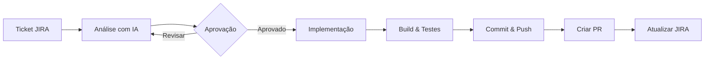

# 🚀 SelfCodeSupport

Sistema Automatizado de Desenvolvimento Integrado com **JIRA**, **Git** e **Anthropic Claude AI**.

[](https://dotnet.microsoft.com/)
[](LICENSE)

## 📋 Visão Geral

O **SelfCodeSupport** é uma API que automatiza o ciclo completo de desenvolvimento de software, desde a análise de tickets JIRA até a criação de Pull Requests, utilizando inteligência artificial para análise de código e geração de soluções.

### 🎯 Funcionalidades

- **📊 Análise Automatizada**: Analisa tickets JIRA e identifica arquivos, mudanças necessárias e impactos
- **🤖 Geração de Código com IA**: Utiliza Claude AI para gerar código seguindo padrões do projeto
- **🔀 Integração Git**: Cria branches, commits e push automaticamente
- **📝 Pull Requests**: Cria PRs com descrição detalhada e checklist
- **📢 Atualização JIRA**: Documenta análise e progresso no ticket
- **✅ Validação**: Build e testes automatizados antes do PR

## 🏗️ Arquitetura

```
SelfCodeSupport/
├── src/
│   ├── SelfCodeSupport.API/          # WebAPI - Controllers e configuração
│   ├── SelfCodeSupport.Core/         # Modelos, Interfaces e Configurações
│   └── SelfCodeSupport.Infrastructure/ # Implementação dos serviços
└── tests/
    └── SelfCodeSupport.Tests/        # Testes unitários
```

### Fluxo de Trabalho



## 🚀 Início Rápido

### Pré-requisitos

- [.NET 8.0 SDK](https://dotnet.microsoft.com/download/dotnet/8.0)
- Conta no [JIRA](https://www.atlassian.com/software/jira) com API Token
- Conta no [GitHub](https://github.com) com Personal Access Token
- API Key da [Anthropic](https://www.anthropic.com/)

### Instalação

1. **Clone o repositório**
```bash
git clone https://github.com/vitorcastro78/SelfCodeSupport.git
cd SelfCodeSupport
```

2. **Restaure as dependências**
```bash
dotnet restore
```

3. **Configure as credenciais**

Edite o arquivo `src/SelfCodeSupport.API/appsettings.json`:

```json
{
  "Jira": {
    "BaseUrl": "https://sua-empresa.atlassian.net",
    "Email": "seu-email@empresa.com",
    "ApiToken": "seu-token-jira"
  },
  "Git": {
    "RepositoryPath": "C:\\caminho\\para\\seu\\repositorio",
    "Credentials": {
      "Username": "seu-usuario",
      "PersonalAccessToken": "seu-github-pat"
    },
    "PullRequestSettings": {
      "Owner": "sua-org",
      "Repository": "seu-repo",
      "ApiToken": "seu-github-pat"
    }
  },
  "Anthropic": {
    "ApiKey": "sua-api-key-anthropic"
  }
}
```

4. **Execute a aplicação**
```bash
cd src/SelfCodeSupport.API
dotnet run
```

5. **Acesse o Swagger**

Abra o navegador em: `https://localhost:5001`

## 📖 Uso da API

### Endpoints Disponíveis

| Método | Endpoint | Descrição |
|--------|----------|-----------|
| POST | `/api/workflow/start/{ticketId}` | Inicia workflow completo |
| POST | `/api/workflow/analyze/{ticketId}` | Executa apenas análise |
| POST | `/api/workflow/approve/{ticketId}` | Aprova e implementa |
| POST | `/api/workflow/revise/{ticketId}` | Solicita revisão |
| POST | `/api/workflow/cancel/{ticketId}` | Cancela workflow |
| GET | `/api/workflow/status/{ticketId}` | Status do workflow |
| GET | `/api/workflow/history` | Histórico de workflows |
| GET | `/api/health` | Health check básico |
| GET | `/api/health/detailed` | Health check detalhado |

### Exemplo de Uso

#### 1. Iniciar Análise

```bash
curl -X POST "https://localhost:5001/api/workflow/analyze/PROJ-1234"
```

**Resposta:**
```json
{
  "ticketId": "PROJ-1234",
  "analyzedAt": "2024-01-15T10:30:00Z",
  "complexity": "Medium",
  "estimatedEffortHours": 4,
  "affectedFiles": [
    {
      "path": "Controllers/UserController.cs",
      "changeType": "Modify",
      "description": "Adicionar endpoint de busca"
    }
  ],
  "status": "Completed"
}
```

#### 2. Aprovar Implementação

```bash
curl -X POST "https://localhost:5001/api/workflow/approve/PROJ-1234"
```

#### 3. Verificar Status

```bash
curl -X GET "https://localhost:5001/api/workflow/status/PROJ-1234"
```

## ⚙️ Configuração Avançada

### Workflow Settings

```json
{
  "Workflow": {
    "RequireApprovalBeforeImplementation": true,
    "AutoBuild": true,
    "AutoRunTests": true,
    "MinimumCodeCoverage": 80,
    "AutoCreatePullRequest": true,
    "AutoUpdateJira": true
  }
}
```

### Convenções de Branch

```json
{
  "Git": {
    "BranchSettings": {
      "FeaturePrefix": "feature/",
      "BugfixPrefix": "bugfix/",
      "HotfixPrefix": "hotfix/"
    }
  }
}
```

### Personalização de Prompts

```json
{
  "Anthropic": {
    "Prompts": {
      "SystemPrompt": "Você é um desenvolvedor sênior especialista em C# e .NET..."
    }
  }
}
```

## 🧪 Testes

Execute os testes unitários:

```bash
dotnet test
```

Com cobertura:

```bash
dotnet test --collect:"XPlat Code Coverage"
```

## 📁 Estrutura do Projeto

```
src/
├── SelfCodeSupport.API/
│   ├── Controllers/
│   │   ├── WorkflowController.cs    # Endpoints do workflow
│   │   └── HealthController.cs      # Health checks
│   ├── Program.cs                   # Configuração da aplicação
│   └── appsettings.json            # Configurações
│
├── SelfCodeSupport.Core/
│   ├── Configuration/
│   │   ├── JiraSettings.cs         # Config JIRA
│   │   ├── GitSettings.cs          # Config Git
│   │   ├── AnthropicSettings.cs    # Config Anthropic
│   │   └── WorkflowSettings.cs     # Config Workflow
│   ├── Interfaces/
│   │   ├── IJiraService.cs         # Interface JIRA
│   │   ├── IGitService.cs          # Interface Git
│   │   ├── IAnthropicService.cs    # Interface Anthropic
│   │   ├── IPullRequestService.cs  # Interface PR
│   │   └── IWorkflowOrchestrator.cs # Interface Orquestrador
│   └── Models/
│       ├── JiraTicket.cs           # Modelo do ticket
│       ├── AnalysisResult.cs       # Resultado da análise
│       ├── ImplementationResult.cs # Resultado da implementação
│       └── PullRequestInfo.cs      # Info do PR
│
└── SelfCodeSupport.Infrastructure/
    ├── Services/
    │   ├── JiraService.cs          # Integração JIRA
    │   ├── GitService.cs           # Integração Git
    │   ├── AnthropicService.cs     # Integração Claude
    │   ├── GitHubPullRequestService.cs # Integração GitHub
    │   └── WorkflowOrchestrator.cs # Orquestrador
    └── DependencyInjection.cs      # Configuração DI
```

## 🔒 Segurança

- **Nunca** commite credenciais no código
- Use variáveis de ambiente ou User Secrets para desenvolvimento
- Em produção, use Azure Key Vault, AWS Secrets Manager ou similar

### Usando User Secrets (Desenvolvimento)

```bash
cd src/SelfCodeSupport.API
dotnet user-secrets init
dotnet user-secrets set "Jira:ApiToken" "seu-token"
dotnet user-secrets set "Anthropic:ApiKey" "sua-api-key"
dotnet user-secrets set "Git:Credentials:PersonalAccessToken" "seu-pat"
```

## 🤝 Contribuindo

1. Fork o projeto
2. Crie uma branch (`git checkout -b feature/nova-feature`)
3. Commit suas mudanças (`git commit -m 'feat: adiciona nova feature'`)
4. Push para a branch (`git push origin feature/nova-feature`)
5. Abra um Pull Request

## 📄 Licença

Este projeto está sob a licença MIT. Veja o arquivo [LICENSE](LICENSE) para mais detalhes.

## 📞 Suporte

- 📧 Email: suporte@selfcodesupport.com
- 🐛 Issues: [GitHub Issues](https://github.com/vitorcastro78/SelfCodeSupport/issues)

---

Feito com ❤️ por [Vitor Castro](https://github.com/vitorcastro78)
